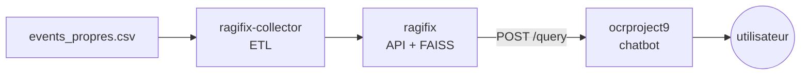
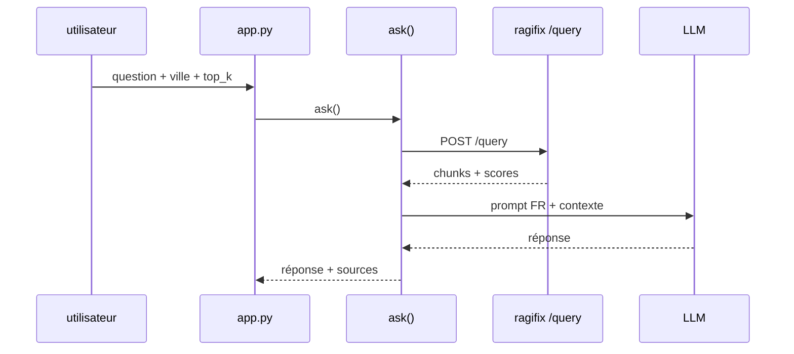

# ocrproject9

Chatbot RAG minimaliste. Il interroge le RAG existant et génère des réponses en français avec LangChain + Mistral.

Le projet est basé sur ragifix, développé par mes soins au cours d'un autre projet :

- [ragifix core](https://github.com/hephaistools/ragifix)

- [ragifix-collector](https://github.com/hephaistools/ragifix-collector)


## 1. Installation

#### Environnement de développement

```bash
cd ocrproject9
python3 -m venv venv
source venv/bin/activate
pip install -r requirements.txt

# renseigner les clés
cp .env.example .env
set -a && source .env && set +a

streamlit run src/app.py
```

`.env` :
   - `MISTRAL_API_KEY` : clé d'api pour le LLM
   - `RAGIFIX_API_TOKEN` : clé d'api pour le RAG
   - `RAG_BASE_URL` : url de l'api du rag (default: `http://127.0.0.1:8421`)
   - Optionnel :
      - `LLM_BASE_URL` : pour changer de fournisseur de LLM (openai compatible).
      - `LLM_MODEL` : nom du modèle à utiliser.

#### Docker

Un seul conteneur fait tourner les 4 briques : `ragifix` + `ragifix-collector` (clonés depuis GitHub) + API chatbot + Streamlit. Au démarrage : `ragifix` → attente `/health` → collector en one-shot en fond + API (uvicorn, :8000) en fond + Streamlit immédiat au premier plan (:8501).

```bash
cd ocrproject9
cp deploy/.env.example deploy/.env  # renseigner les 7 variables (voir tableau)
docker build -f deploy/Dockerfile -t ocrproject9 .
docker run -d --name ocrproject9 --env-file deploy/.env \
  -p 8501:8501 -p 8000:8000 \
  -v /chemin/hote/events_propres.csv:/data/events_propres.csv:ro \
  -v ocr9-ragdata:/var/lib/ragifix \
  -v ocr9-state:/var/lib/ragifix-collector \
  ocrproject9
# puis http://localhost:8501 (UI) et http://localhost:8000/docs (API, Swagger)
```

`deploy/.env` (seul fichier de config à remplir) : *cf section précédente*

## 2. Exécution de l'API REST

Lancement depuis `ocrproject9/` (RAG + boîte LLM lancés, `.env` renseigné) :

```bash
set -a && source .env && set +a
uvicorn api:app --app-dir src --port 8000
```

Interrogation :

```bash
curl -X POST http://127.0.0.1:8000/ask \
    -H "Content-Type: application/json" \
    -d '{"question":"concert ce week-end ?","city":"Marseille","top_k":5}'
```

## Documentation

### Dossier eval/ (scripts manuels, jamais de CI)

`tests/` tourne en CI sans rien lancer (tout est simulé). `eval/` se lance à la main contre les vrais services (RAG, LLM, clés). `api_test.py` est donc ici : vérifier que le RAG répond exige un RAG lancé.

- `dataset.jsonl` : 10 questions annotées + sources attendues (uid extrait du top-50 RAG, triées à la main).
- `api_test.py` : 5 checks HTTP du RAG (`/health`, `/query` nominale/vide/token/ville).
- `evaluate_rag.py` : interroge le RAG directement pour chaque question du dataset, compare les uid retournés aux sources attendues. Sort un score de recall sur les sources.
- `eval_qualite.py` : évaluation de la qualité des réponses du chatbot avec Ragas sur 3 métriques : `faithfulness` (fidélité au contexte), `context_precision` et `context_recall` (couverture documentaire).

### Vue générale

3 briques utiles :



### Pourquoi 3 dépôts ?

La consigne suppose un seul dépôt, mais le RAG préexistait (alternance Niji) en 3 briques : `ragifix` (API), `ragifix-collector` (ETL). `ocrproject9` est uniquement le chatbot Étape 4, qui réutilise ce RAG sans le modifier.

## 3. Détail des briques

- **ragifix-collector (ETL)** : lit `events_propres.csv`, nettoie et découpe par événement, pousse vers `ragifix` via son API.
- **ragifix** : lors de la réception d'un document, réalise le parsing, le chunking, l'embedding, puis stocke dans une base de données FAISS.
- **ocrproject9 (ce dépôt)** : `src/config.py` lit `.env` ; `src/backend.py` = client pour l'endpoint `/query` de ragifix + `RagifixRetriever` pour s'intégrer avec langchain + `ask(question, city, top_k)` = toolchain de réponse du LLM avec appel du rag ; `src/app.py` = Streamlit.



