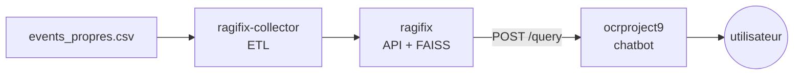
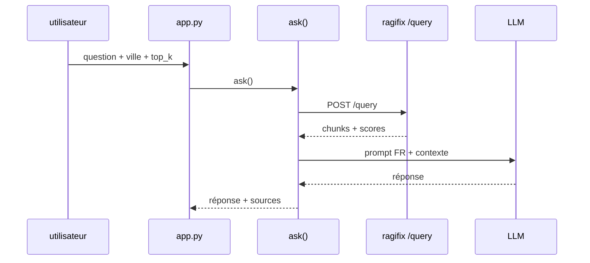

# ocrproject9 — chatbot Événements (Étape 4, POC)

Chatbot RAG minimaliste. Il interroge le RAG existant et génère des réponses en français avec LangChain + Mistral.

## 1. Installation (environnement de développement)

```bash
cd ocrproject9
python3 -m venv venv
source venv/bin/activate
pip install -r requirements.txt
cp .env.example .env  # renseigner les clés
streamlit run src/app.py
```

`.env` :
   - `MISTRAL_API_KEY` : clé d'api pour le LLM
   - `RAGIFIX_API_TOKEN` : clé d'api pour le RAG
   - `RAG_BASE_URL` : url de l'api du rag (default: `http://127.0.0.1:8421`)
   - Optionnel :
      - `LLM_BASE_URL` : pour changer de fournisseur de LLM (openai compatible).
      - `LLM_MODEL` : nom du modèle à utiliser.

Tests : `pytest` (26 tests, ~99 % couverts). CLI : `python src/backend.py "question ?" --city Paris --top-k 5`.

## 2. Vue générale

3 briques utiles :



## 3. Détail des briques

- **ragifix-collector (ETL)** : lit `events_propres.csv`, nettoie et découpe par événement, pousse vers `ragifix` via son API.
- **ragifix** : lors de la réception d'un document, réalise le parsing, le chunking, l'embedding, puis stocke dans une base de données FAISS.
- **ocrproject9 (ce dépôt)** : `src/config.py` lit `.env` ; `src/backend.py` = client pour l'endpoint `/query` de ragifix + `RagifixRetriever` pour s'intégrer avec langchain + `ask(question, city, top_k)` = toolchain de réponse du LLM avec appel du rag ; `src/app.py` = Streamlit.



## 4. Pourquoi 4 dépôts ?

La consigne suppose un seul dépôt, mais le RAG préexistait (alternance Niji) en 3 briques : `ragifix` (API), `ragifix-collector` (ETL). `ocrproject9` est uniquement le chatbot Étape 4, qui réutilise ce RAG sans le modifier.
